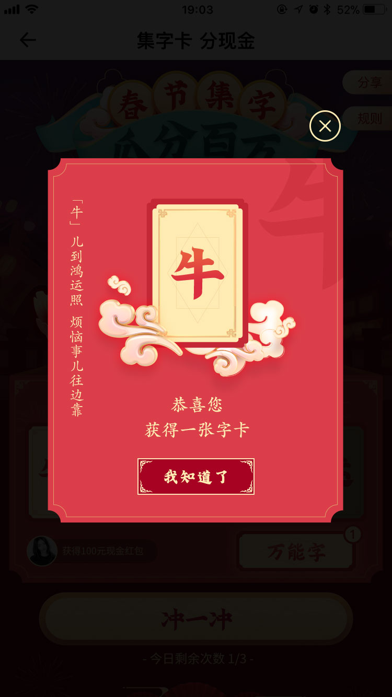

# svg实战
## 图片压缩
因为svg的在html中可编程性质，图片压缩在svg上的想象空间很大。
* 高清矢量图。比如logo，icon等几何图形或者由几何图形组合的复杂结构，用svg代码文本来做，会比jpg或者png小很多。比如微软搜索的logo，https://cn.bing.com/
* 动画。能用css实现的动画，尽量用css来做，需要的代码会少很多；但经常有一些css做不到的，如路径动画。如果用gif或者video，资源就大很多了。这时候就适合用svg来做；
* 使用svg做“裁剪路径”，与jpeg配合实现“镂空”效果。大部分情况下，Jpg的资源大小会比png小很多。

## 需求
活动需求，开发一个如下图的功能
